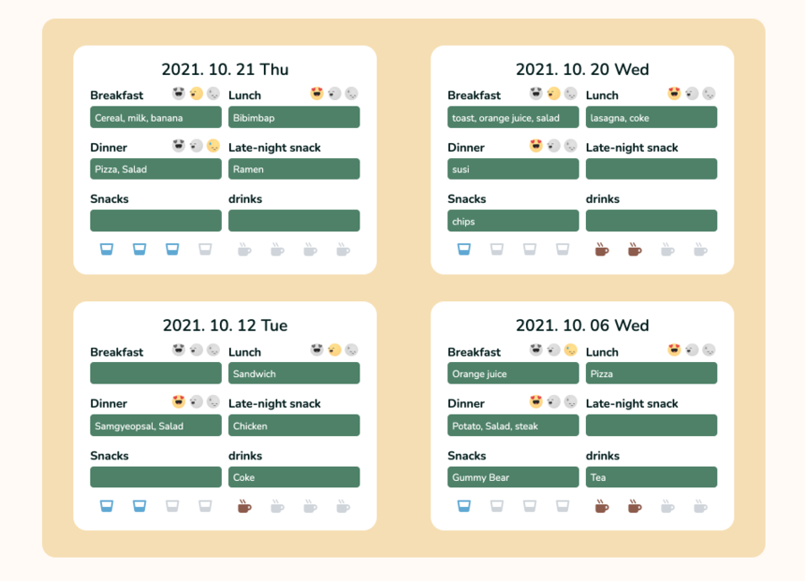

# :cookie: Food log & plan :green_salad:
You can try the project.
Project Link: <https://globalkmaria.github.io/foodlog/>

## Table of contents

- [Project duration](#Project-duration)
- [Technologies](#technologies)
- [What is Food log & plan?](#What-is-Food-log-&-plan)
- [Why Food log & plan?](#Why-Food-log-&-plan)

## Project duration
2021/Oct/18 - 2021/Oct/20

## Technologies

  

## What is Food log & plan?

Food log & plan is made to track and plan your meals.
You can track Breakfast, Lunch, Dinner, Late-night Meal, Snacks, Drinks, Water, and Coffee(or Tea whichever you wish for).

## Why Food log & plan?

1. No need to log in! Using local storage, you can save and check your logs always without login.
2. It uses a Binary Tree algorithm to add your new log so faster to add!
3. Date is already set up to make your log faster and easier!
4. You can check your mood for each meal! It will help you to remind how the meal was or the day was when you track back :)
5. Just one button to reset Everything!

    
    
   
   
